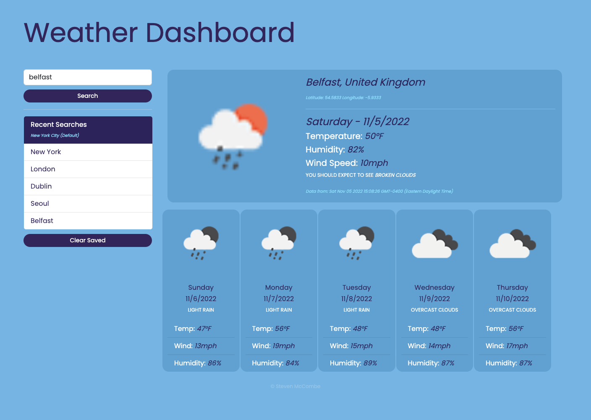

# Weather-Report-App

## 💡 Description
To showcase my API and Javascript skills, I designed a weather forecasting application that takes in a users search criteria for a particular city and returns the current/forecasted weather conditions. The webpage uses two different API calls to collect data based on the users criteria. While building this I learned how powerful APIs can be when it comes to web design. It give me a great understanding in how they work and how they could be implemented in other projects. 

## 🔗 Links

[Deployed Application](https://steven-mccombe.github.io/Weather-Report-App/)

## 📸 Screenshot

## 📝 Credits
- API - Courtesy of [Openweathermap.org](https://openweathermap.org/)
- Font - Courtesy of [Google Fonts.](https://fonts.google.com/specimen/Poppins?category=Sans+Serif)
- Fontend Toolkit - Courtesy of [Bootstrap.](https://getbootstrap.com/)

## 📝 License
MIT license